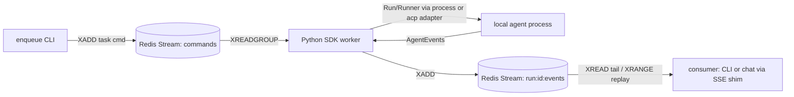
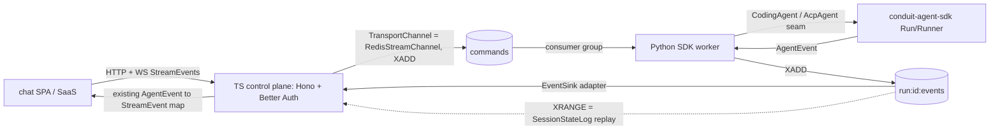
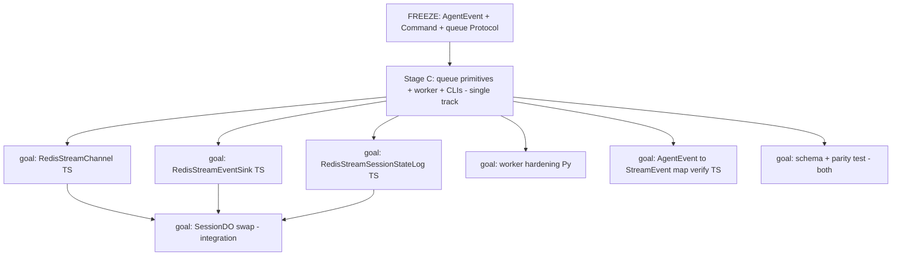

# Design: A queue-backed, zero-vendor prototype of agent-coordinator's run loop on conduit-agent-sdk

- **Date:** 2026-06-19
- **Status:** Draft — awaiting user review
- **Author:** Kevin Hill (with agent)
- **Scope note:** This spec covers a two-stage effort, **C → A**. Stage C (the bare run-loop spike) is the first implementation plan; Stage A (the strangler prototype) is a follow-on plan. `writing-plans` should start with Stage C.

## 1. Context & problem

`agent-coordinator` (`/Users/kevinhill/Coding/Projects/agent-coordinator`) is a complete, working, multi-tenant control plane for hosted coding agents:

- **Control plane** — a Cloudflare Worker (Hono, ~35 routes) with three-tier auth (`x-api-key` → Bearer → cookie → Better Auth) resolving to `{userId, orgId, teamId}`.
- **Session actor** — one `SessionDO` Durable Object per session: a FIFO messages-table queue, `processMessageQueue` dispatcher, `ackId` critical-event redelivery, alarms, hibernation, and a hibernation-safe WebSocket bridge.
- **Data plane** — Modal (`packages/modal-infra`, HMAC) plus `packages/sandbox-runtime` (supervisor + `bridge.py` + OpenCode).
- **Storage** — Postgres via Hyperdrive (Better Auth + app data); ephemeral DO SQLite per session. `run == session` (ADR 0009).

**The pain (chosen):** the system is *difficult to operate and develop*. Doing anything requires Cloudflare **and** Modal **and** OpenCode wired up together; local development, cross-vendor debugging, and the bridge protocol that is **duplicated by contract** on both the Python and TypeScript sides are the daily friction.

**The goal:** prototype simpler versions of this architecture on `conduit-agent-sdk` as the runtime foundation, running locally in a sandbox, with components communicating through a durable event queue — and parallelize the build. Validate before reworking the larger system. A big-bang rewrite is explicitly rejected.

## 2. Reframe: the lock-in is concentrated, not pervasive

A prior hexagonal cutover already decoupled most of the system (16 ports across 5 planes in `src/lib/ports/registry.ts`). Verified reality:

| Vendor | Lives in | Reality |
|---|---|---|
| **OpenCode** | `CodingAgent` port | Already swappable — `OpenCodeAgent` **and** `AcpAgent` adapters both exist. conduit-agent-sdk is an ACP client → it slots in here with no new port. |
| **Modal** | `SandboxProvider` port | Deepest leak — vendor lifecycle states (Daytona/Modal/e2b/Fly) are baked into the canonical `SandboxState` enum. `LocalProvider`/`LocalProcessProvider` already exist. |
| **Cloudflare** | `SessionDO` orchestration | The FIFO + `ackId` redelivery + alarms + hibernation is **bespoke reliability machinery** — precisely what a durable queue replaces. Coordination ports (`EventSink`, `TransportChannel`, `SessionStateLog`) are clean with memory adapters. |

`src/lib/controller/create-local-controller.ts` already wires a **no-Modal / no-Cloudflare / no-OpenCode** path (`LocalProcessProvider` + `AcpAgent` + `InProcessChannel` + `MemoryEventSink` + `MemorySessionState`). The prototype grows *this* path; it is not a rewrite.

**The one genuinely net-new piece:** `conduit-agent-sdk` today is an **in-process runtime**. `SessionStore` is append + one-shot poll (no subscribe), `Run.events()` is an in-process async iterator (no SSE / network consumer protocol), and the Redis backend uses lists/sets, **not Streams**. So the durable-queue transport + subscribe is net-new work; the SDK supplies the runtime and the `AgentEvent` wire format, but no transport to ship events to remote/durable consumers.

> **Caution (registry/impl skew):** many adapters named in `registry.ts` are *unbuilt* (Repository, BlobStore, Observability, Metering, SourceControl, AES/KMS secrets). Only memory/fake adapters plus a few real ones (`PgSecretsManager`, `ModalProvider`, `OpenCodeAgent`, `AcpAgent`, `LocalProcessProvider`) exist. Do not assume a registry-named adapter exists.

## 3. Goals & non-goals

**Goals**
- A run loop that executes locally with **zero vendor accounts** (`docker run redis` is the only dependency).
- One event schema (`AgentEvent`) end-to-end, replacing the duplicated-by-contract bridge protocol.
- A durable event queue as the integration backbone, enabling parallel development.
- A strangler path: the existing Cloudflare/Modal/OpenCode production path stays live until the queue path proves out.

**Non-goals (deferred)**
- Real Docker/Modal sandbox networking, multi-region, or production cutover.
- Reworking the chat UI or the consumer API (their contracts are preserved).
- Replacing the queue technology choice (Redis Streams is the prototype pick; the contract stays transport-agnostic so Kafka/JetStream is a later transport swap).
- Building the unbuilt resource-plane adapters (Repository/BlobStore/etc.).

## 4. Approach: C → A (decided)

- **C — bare run-loop spike.** No control plane. A CLI enqueues a task → a Python SDK worker runs the agent locally → publishes `AgentEvent`s to a per-run stream → a consumer tails/replays them. De-risks the net-new queue transport and proves the backbone locally.
- **A — queue-behind-the-ports strangler.** Grow C behind the existing ports: Redis-Streams adapters for `TransportChannel`/`EventSink`/`SessionStateLog`; the agent behind the existing `CodingAgent`/`AcpAgent` seam; `SessionDO` kept as session owner with its WS-bridge guts swapped for queue publish/subscribe. The chat client and the Modal production path are untouched.

**Rejected — B (Python-native thin control plane):** reimplementing the control plane in Python discards the Better Auth wiring, the 16 ports, and the chat contract, and diverges from the larger system it is meant to prototype — so its lessons would not transfer.

## 5. Architecture

### Stage C



### Stage A



## 6. Queue contract (the freeze)

Two stream roles on Redis:

| Stream | Direction | Delivery | Carries |
|---|---|---|---|
| `commands` | control → worker | consumer group `workers`, `XACK` + PEL redelivery | **Command** envelope (new) |
| `run:<run_id>:events` | worker → consumers | `XREAD BLOCK` (tail) + `XRANGE` (replay) | **`AgentEvent`** envelope (exists) |

- **Ordering** — per-`run_id` ordering is free: one event stream per run; Redis streams are ordered within a stream. The reducer's monotonic `sequence` is the dedupe key.
- **Idempotency** — consumers dedupe on `(run_id, sequence)`; a worker dedupes a redelivered command by checking whether `run:<run_id>:events` already exists.
- **Reliability (subsumes `ackId`)** — command durability + the consumer-group pending-entries list replace "re-send until acked"; per-run event durability + replay-from-last-seen-id replace per-critical-event re-send. No bespoke ack protocol survives.
- **Replay = rehydration** — `SessionStateLog` reads the run stream via `XRANGE` to rebuild state, replacing the DO SQLite events table on the prototype path.
- **Terminal** — the worker emits the SDK terminal `run.completed|failed|cancelled`; consumers stop tailing on `event_catalog.terminal_types`.
- **Retention** — `XADD ... MAXLEN ~` bounds streams; trim a run's stream on terminal + a grace window.

**Command envelope** (small, new) — a queue-native subset of the existing `CONTROL_COMMANDS`:

```
Command { type: "prompt" | "stop" | "cancel", runId, task?, agent?, model? }
```

## 7. Components & interfaces

**Stage C (Python — the reusable foundation):**
- `queue/` — three net-new primitives behind a transport-agnostic `Protocol`: `publish(stream, event)`, `consume(group, consumer)` (`XREADGROUP` + `XACK`), `subscribe(stream, last_id)` (`XREAD BLOCK`), `replay(stream, start, end)` (`XRANGE`).
- `worker.py` — `consume → Runner.start(task, adapter=process_adapter|acp) → async for ev in run.events(): publish(run:<id>:events, ev)`; idempotent on `runId`; runs `redaction` on each event before publish.
- `enqueue` CLI and a `tail`/SSE-shim consumer.

**Stage A (TypeScript — reuses C unchanged):**
- `RedisStreamChannel` → `TransportChannel` port; `RedisStreamEventSink` → `EventSink`; `RedisStreamSessionStateLog` → `SessionStateLog`.
- `SessionDO` swap: on the controller/ACP path, replace WS-bridge spawn with *publish Command → subscribe run events → reuse the existing `AgentEvent`→`StreamEvent` mapping → broadcast to the client WS*. The Modal/OpenCode path stays behind the existing `SANDBOX_RUNTIME` flag.

**Freeze points** (agreed before any fan-out): the `AgentEvent` envelope (exists), the `Command` envelope (new), and the queue `Protocol`.

## 8. Error handling & reliability

- **Worker crash mid-run** — the PEL redelivers the command. **Stage C policy: fail-fast** (emit `run.failed`; the agent process died with the worker). **Stage A policy: restart the run (idempotent on `runId`) up to a max-retry count, then emit `run.failed`.**
- **At-least-once** — consumers dedupe on `sequence`.
- **Poison command** — max-deliveries → a `commands:dead` dead-letter stream.
- **Secrets** — reuse the SDK `redaction` stage on every event *before* publish; nothing secret reaches the queue; BYOK keys are never published.
- **Timeouts** — enforced by the SDK reducer's deadline budget plus a worker watchdog, not DO alarms.

## 9. Testing strategy & acceptance criteria

- **Mock-first** (SDK principle 6) — the worker runs `mock_adapter` scripts; assert events land on the stream and `replay` reconstructs the transcript. No real agent required.
- **One schema, one parity test** — mirror the existing `bridge-protocol-parity.test.ts`, but over the single `AgentEvent` + `Command` schema validated on both the Python worker and TS adapter sides. This is the collapse of the duplicated-by-contract pain.
- **Crash / idempotency** — redeliver a command; assert no duplicate run and dedupe by `sequence`.

**Stage C acceptance:** `docker run redis` + worker + `enqueue` + `tail` reconstructs a full transcript with **no Cloudflare / Modal / OpenCode**; `XRANGE` replay reproduces it; a redelivered command produces no duplicate run; the `AgentEvent`+`Command` parity test passes.

**Stage A acceptance:** the control plane publishes a `Command` instead of spawning a Modal bridge; the chat client is unchanged and still receives `StreamEvent`s (now sourced from the queue); `SessionStateLog` replay rehydrates a session; the Modal production path still works behind its flag.

## 10. Parallelization plan

Maps onto the existing `.sisyphus` model (vertical "goals," each a Goal/Files/Do/Don't/Done contract, each in a `goal/NN-slug` git worktree via `spawn-goals.sh`, or `task` `isolated:true` + IRC).



- The **freeze** (envelopes + queue Protocol) is the single serializing step. Everything waits on it; nothing waits after it.
- **Stage C is one tight track** — it builds the shared foundation everyone reuses; do not parallelize it.
- **Stage A fans out** — each port adapter is an independent goal, collision-free because adapters are disjoint and integrate only through the frozen queue contract. The `SessionDO` swap is the one integration goal; sequence it last.

## 11. Decisions (locked)

These were the spec's open questions; all resolved to the recommended defaults (2026-06-19, user sign-off):

- **Stage A crash policy** — restart the run (idempotent on `runId`) up to a max-retry count, then emit `run.failed`. Stage C remains fail-fast.
- **Queue migration target** — Redis Streams for the prototype; the larger-target choice (NATS JetStream vs Kafka/Redpanda) is deliberately deferred. The `AgentEvent` + `Command` contract and the queue `Protocol` stay transport-agnostic, so migration is a transport swap, not a contract rewrite.
- **Where Stage C code lives** — in `conduit-agent-sdk` as a new `queue/` module plus a worker entry point (not a separate package). Stage A's TypeScript adapters live in `agent-coordinator` behind its existing ports.
